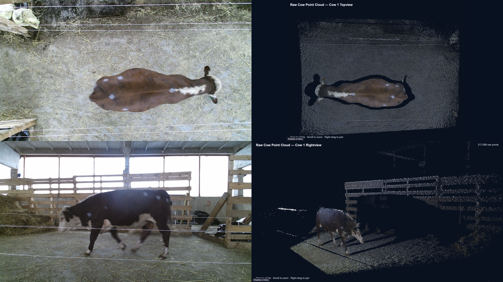
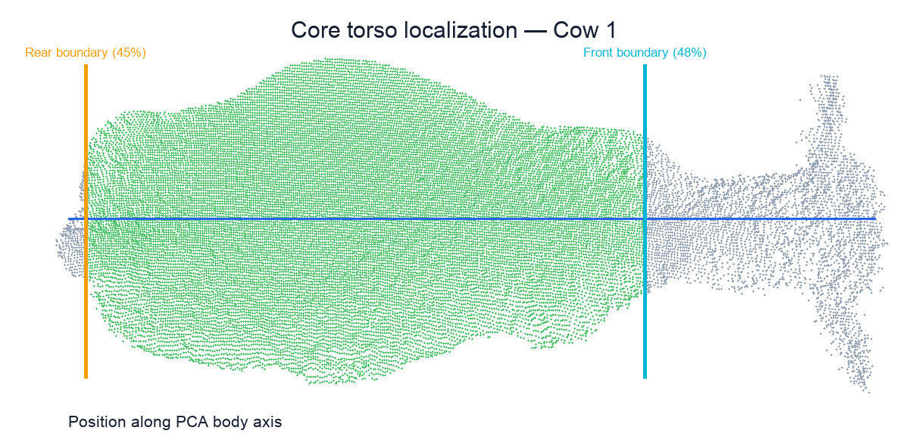
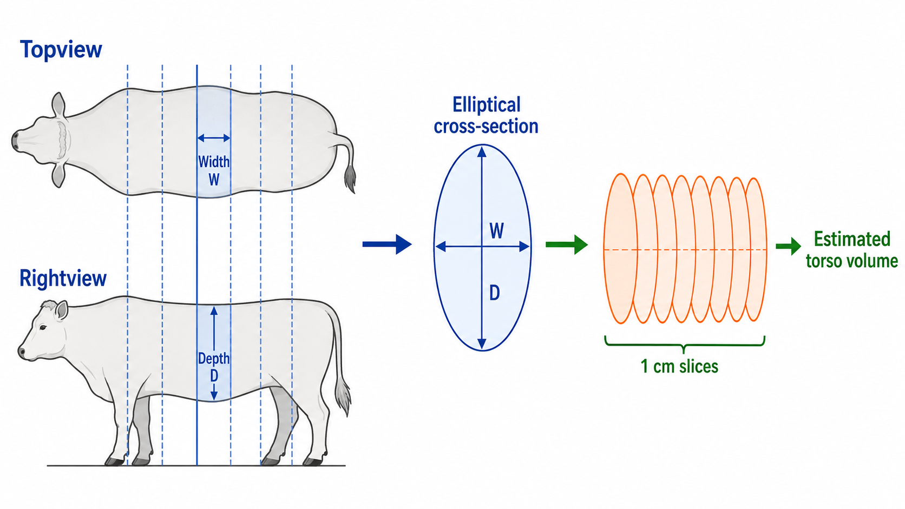
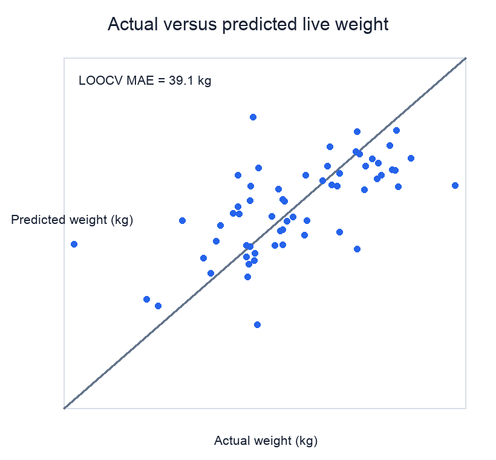

# Camera Vision Weighing for Livestock

This project estimates cattle live weight from Topview and Rightview depth point clouds. It uses automatic point-cloud processing and geometric body measurements instead of manual feature annotation.



## 1. Dataset

### 1.1 Data Source

This project uses the public CowDB dataset published by Ruchay et al. (2020).

The dataset contains RGB-D images, multi-view point clouds, manual body measurements and live weights for 154 Hereford cattle.

**Dataset paper:**  
Alexey Ruchay et al. “Accurate body measurement of live cattle using three depth cameras and non-rigid 3-D shape recovery.” *Computers and Electronics in Agriculture*, 179, 105821.

https://doi.org/10.1016/j.compag.2020.105821

### 1.2 Data Used in This Project

The original 154 cattle records were manually reviewed for body visibility and point-cloud completeness.

A subset of 61 cattle was selected. These cattle had sufficiently complete body structures for geometric measurement, with at least one visible ear used as a basic visibility requirement.

Each selected record contains:

- A usable Topview point cloud
- A usable Rightview point cloud
- A ground-truth live-weight measurement
- Sufficiently complete body contours for torso measurement

## 2. Method

Depth data from the Topview and Rightview cameras are first converted into 3D point clouds. These point clouds allow measurable cattle body dimensions—such as torso length, width, depth, projected area and estimated volume—to be extracted without direct physical contact.

These geometric measurements are then compared with the ground-truth live weights to identify features associated with body weight. Regression models use the selected features to estimate live weight. Therefore, reliable point-cloud processing and accurate calculation of body dimensions are central to the overall prediction workflow.

```text
Topview and Rightview depth data
→ 3D point-cloud generation
→ Ground removal and cattle segmentation
→ PCA body-axis alignment
→ Core torso localization
→ Body-dimension and geometric-feature extraction
→ Correlation analysis and feature selection
→ Live-weight prediction
→ Leave-one-out cross-validation
```

### 2.1 Point-cloud Processing

The raw point clouds contain the cattle together with the floor, fences and other surrounding structures. Ground removal and cattle segmentation are applied to isolate the animal. The segmented body is then aligned along its principal axis using principal component analysis (PCA), providing a consistent coordinate system for geometric measurement.

### 2.2 Body-dimension Extraction

After alignment, the core torso region is identified to reduce the influence of the head, neck, legs and tail. Geometric measurements are extracted from the Topview and Rightview point clouds, including:

- Torso length
- Topview body width
- Rightview body depth
- Projected body area
- Local body widths and depths
- Estimated torso volume

The main three-dimensional feature is the estimated torso volume. The torso is divided into approximately 1 cm slices, and each slice is approximated as an ellipse using its Topview width and corresponding Rightview depth.

$$
V = \sum_i \frac{\pi}{4} W_i D_i \Delta x
$$

Here, $W_i$ is the Topview body width, $D_i$ is the corresponding Rightview body depth and $\Delta x$ is the slice thickness.

### 2.3 Weight Prediction and Evaluation

The extracted dimensions and geometric features are assessed according to their relationships with measured live weight. Individual features and selected feature combinations are then used to construct regression models for live-weight estimation.

Prediction performance is evaluated using leave-one-out cross-validation, so each animal is predicted by a model trained on all remaining animals.

## 3. Results

### 3.1 Quantitative Results

Results on the selected 61 cattle:

| Model | Pearson r | Predictive R² | MAE |
|---|---:|---:|---:|
| Elliptical torso volume | 0.643 | 0.413 | 39.7 kg |
| Elliptical volume + Rightview median depth | **0.651** | **0.419** | **39.1 kg** |
| Elliptical volume + rump height + rump width | 0.612 | 0.370 | 41.4 kg |

The current best result is a leave-one-out cross-validation MAE of **39.1 kg**.

### 3.2 Visual Examples

#### Core Torso Detection



The Topview point cloud is aligned using PCA before the core torso boundaries are detected.

#### Elliptical Torso Slices



Topview width and Rightview depth are combined to estimate the volume of each torso slice.

#### Actual and Predicted Weight



The plot compares measured cattle weight with leave-one-out cross-validation predictions.

## 4. Limitations

- The current evaluation contains only 61 manually selected cattle.
- Manual data selection may introduce sample-selection bias.
- Topview and Rightview measurements are matched using relative body positions rather than calibrated multi-camera coordinates.
- Walking posture, leg position and incomplete body contours can affect geometric measurements.
- The results have not been validated on cattle from different breeds or farms.
- This is a research prototype rather than a production weighing system.
